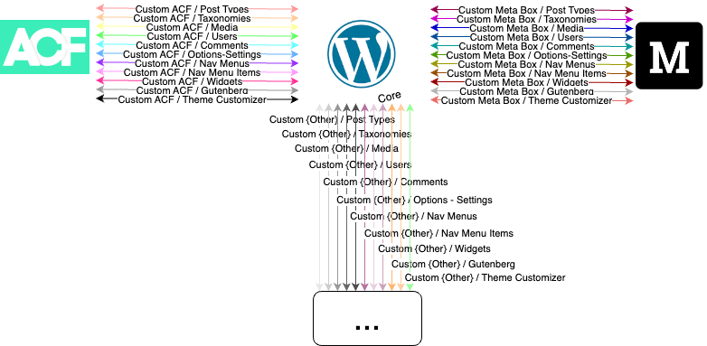
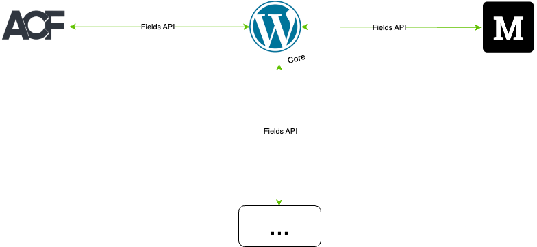

By implementing a normalized interaction model for each of the standard elements and creating a playbook for integration as the ecosystem expands, users will be able to leverage the same interaction model regardless of which theme or plugin they are connecting to core.

## Current State

Note: Each one of these integration points requires unique and independent development in order to define and maintain the interaction.

## Future State

Note: Any interaction for the same element is identical regardless of context.
